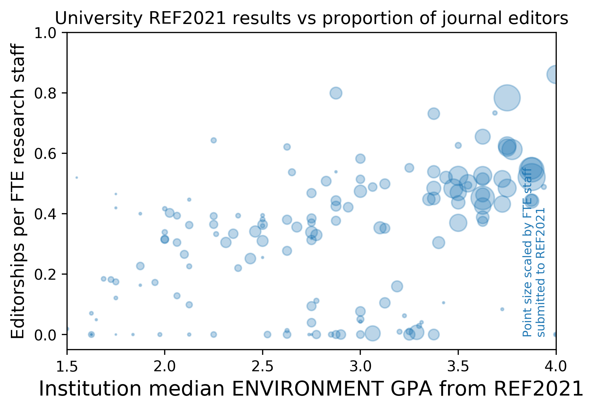
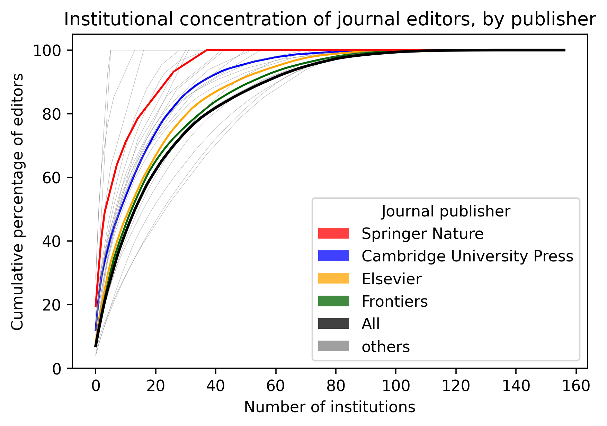

Using the Open Editors data to explore journal editorship in UK Universities

# REF2021 data 

The REF provides data on evaluation of University research outputs and environments. You can *crudely* position institutions by the average (median) score their received in the REF across all the units of assessment (roughly, 'disciplines') they submitted.

Institutions also differered in how many research staff they have / they submitted. The largest was University of Oxford, which submitted ~3400 FTE staff. See <https://github.com/tomstafford/ref2021>

# Open Editor Data

Open Editors project <https://openeditors.ooir.org/> scrapes data on journal editors and their affiliations.

The data is messy, often out of data and incomplete. Some publishers (e.g. Taylor and Francis) are not checked. Some editors list their affiliations inconsistency. For my data. this means that institutions with more variations on their name will be undercounted (e.g. LSE could be "LSE", "London School of Economics","The London School of Economics and Political Science", etc)

Reference: Nishikawa-Pacher, Andreas, Tamara Heck and Kerstin Schoch (2022), "Open Editors: A Dataset of Scholarly Journals’ Editorial Board Positions", Research Evaluation, DOI: 10.1093/reseval/rvac037. 

# Nonetheless

It is interesting to try to understand the institutional context of journal editing. Like reviewing, journal editing is often underrecognised and only indirectly rewarded by institutions. It comes with some prestige and influence, but also adds work to academics who have many competing obligations.

For an initial investigation, I plotted REF score against proportion of journal editors (almost always a value below 1, indicating that institutions invariably have more staff than they have staff who are also editors). 

I made a [crude version with rollover functionality](https://tomstafford.github.io/editors/figs/plotly.html), so you can pick out your favourite UK institutions. Imperial is in the top right, UCL is the large blop nearly as high up the y axis. Oxford is the largest blob, on the x=3.5 line. 

# Caveats

My analysis "double-counts" individuals who are editors on more than one journal

There's more to life than REF scores (but you might not know it from the way some institutional processes work)

# Next?

I'm thinking about what else to do with these data, so feedback is welcome, by email or to [@tomstafford](https://mastodon.online/@tomstafford)

Repo: <https://github.com/tomstafford/editors>

# Updates

## 2023-05-24

Lizzie Gadd asks what the plot would look like if it was only the 'environment' component of the REF on the x-axis. Here we are

Rollover version [here](figs/plotlyENV.html)

## 2023-05-25

I got to wonder about how different publishers editing activity is concentrated vs spread across UK institutions. The Open Editors dataset contains these publishers (and these counts of editorial positions which I could associate with UK institutions)

|PUBLISHER                            |EDITORS|
|:------------------------------------|------:|
| Frontiers                           | 14921 |
| Elsevier                            |  6312 |
| SAGE                                |  5019 |
| Cambridge University Press          |  1568 |
| Emerald                             |  1415 |
| Inderscience                        |  1094 |
| BioMedCentral                       |   837 |
| PLOS                                |   683 |
| MDPI                                |   530 |
| Brill                               |   501 |
| IGI Global                          |   486 |
| Hindawi                             |   400 |
| Royal Society of Chemistry          |   265 |
| John Benjamins                      |   237 |
| Longdom                             |   177 |
| Springer Nature                     |   163 |
| SCIRP                               |   144 |
| Karger                              |   132 |
| PeerJ                               |   129 |
| American Psychological Association  |   128 |
| SciTechnol                          |    57 |
| iMedPub                             |    52 |
| eLife                               |    47 |
| Pleiades                            |    30 |
| American Society of Civil Engineers |    14 |
| Allied Academies                    |     6 |
| **ALL**                             | **35347** |

As [Christopher Eliot notes](https://mastodon.online/@chreliot@mastodon.social/110423655357454243), because not all publishers are represented, this *undercounts* the extent of editorial work done by UK academics.

The plot below shows the cumulative percentage of editors when you count increasing number of institutions, starting with the institutions which host the most editors from that publisher. This means that if a publisher's editors are concentrated in a smaller number of institutions then their curve will reach more towards the top left.

By reading off from a set y-axis point you can judge how many institutions contain Y% of a publisher's editors. For example, over all publishers ("All") about 40 institutions host 80% of editors. 

I've highlighted some specific publishers, which show different curves. You can decide for yourself if this shows differential institutional capture of publishers, or publishers' differnetial capture of institutions.

After making the graph I realised a simple view would be a table which showed the number of institutions across which all a publisher's editors are spread:

|         PUBLISHERS        |   INSTITUTIONS|
|:------------------------------------|----:|
| Allied Academies                    |   6 |
| American Society of Civil Engineers |   6 |
| eLife                               |  14 |
| Pleiades                            |  17 |
| Karger                              |  29 |
| SciTechnol                          |  31 |
| iMedPub                             |  32 |
| Royal Society of Chemistry          |  38 |
| Springer Nature                     |  38 |
| American Psychological Association  |  43 |
| PeerJ                               |  44 |
| SCIRP                               |  51 |
| John Benjamins                      |  53 |
| Longdom                             |  56 |
| Brill                               |  71 |
| Hindawi                             |  74 |
| PLOS                                |  83 |
| BioMedCentral                       |  87 |
| Cambridge University Press          |  89 |
| IGI Global                          |  94 |
| MDPI                                |  94 |
| Inderscience                        |  96 |
| Emerald                             | 101 |
| Elsevier                            | 113 |
| Frontiers                           | 114 |
| SAGE                                | 121 |
| **ALL**                         | **134** |
